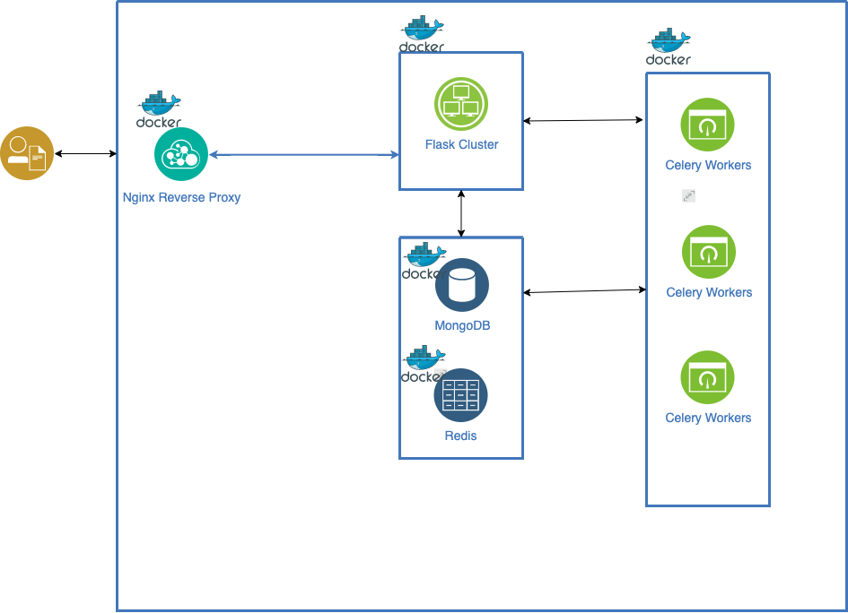
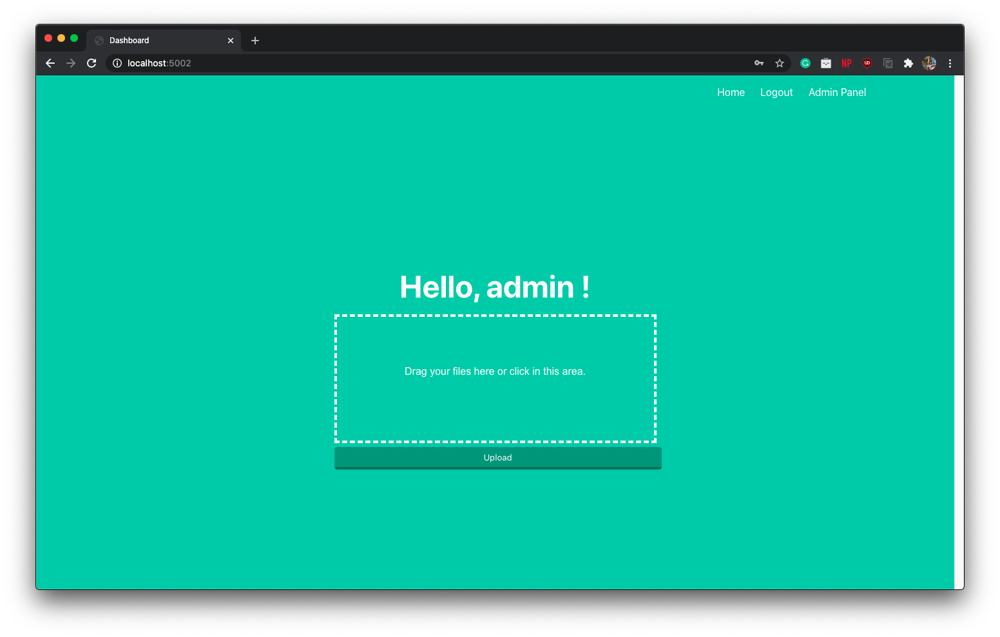
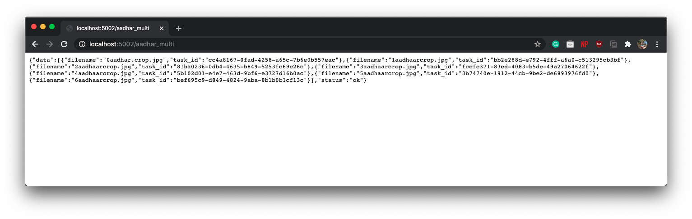
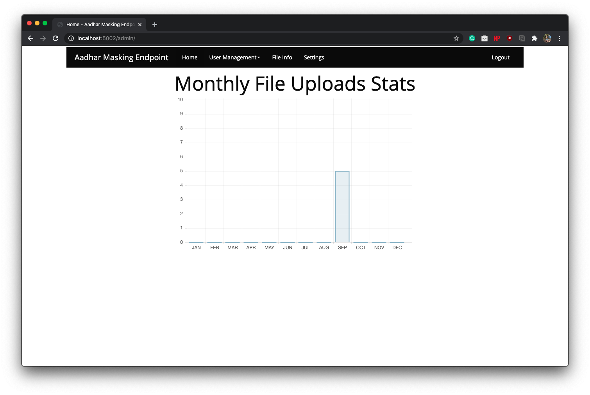
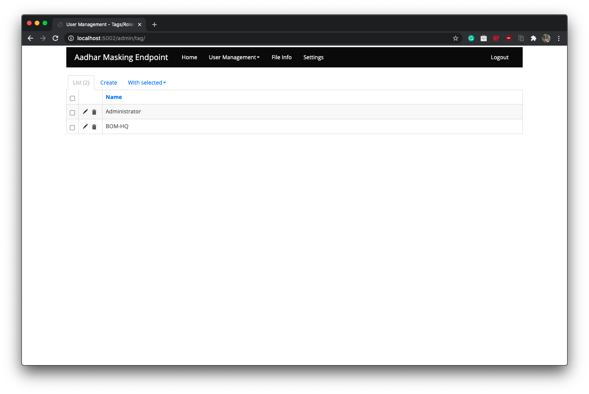
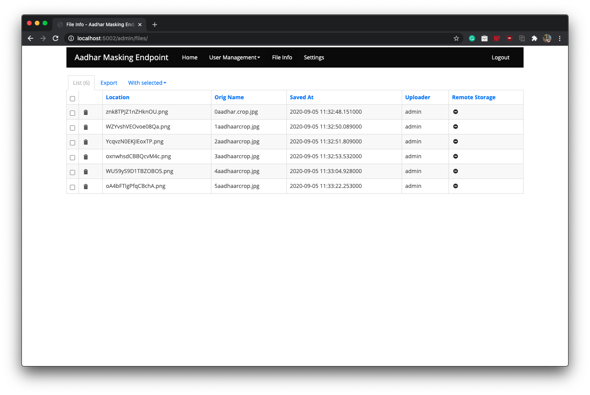

# LargeScale-AadharMask

 
University Project - 

Nginx, Celery, Flask, Gunicorn, Redis based scalable aadhar card masking portal

Masks sensitive information on aadhar card images using [EAST: An Efficient and Accurate Scene Text Detector](https://arxiv.org/abs/1704.03155) and OpenCV

## Architecture

## Screenshots

